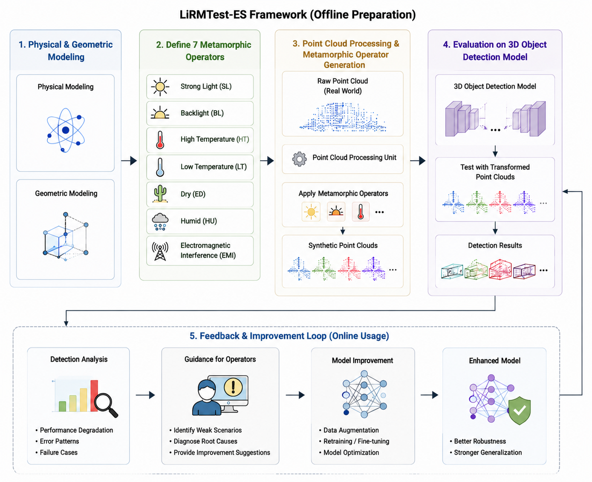

# LiRMTest-ES

<p align="center">
  <strong>Exposing and Rectifying LiDAR Perception Failures via Multi-Physics Metamorphic Relations in Extreme Environments</strong>
</p>

<p align="center">
  Physics-informed metamorphic testing and data augmentation for LiDAR-based 3D object detection.
</p>

<p align="center">
  Zhendong Li · Shiyu Yan
</p>

---

## Overview

**LiRMTest-ES** is a metamorphic testing framework designed to expose and rectify failures in LiDAR-based 3D object detectors under extreme environmental conditions.

The framework models how lighting, temperature, atmospheric conditions, and electromagnetic interference affect raw LiDAR measurements. It then generates physically motivated point-cloud transformations whose semantic labels remain unchanged. These transformed point clouds serve two purposes:

1. **Robustness testing:** detect missed objects, false positives, localization drift, and other violations of expected output consistency.
2. **Model improvement:** augment the training set with adverse-condition point clouds and retrain the detector.

LiRMTest-ES evaluates four representative 3D object detectors—**PointPillars, SECOND, Part-A2, and PV-RCNN**—on the **KITTI** benchmark through the **OpenPCDet** framework.

<p align="center">
  
</p>

## Highlights

- **Seven physics-informed operators** covering thermal, optical, hygrometric, particulate, and electromagnetic disturbances.
- **Oracle-free testing** through explicit metamorphic relations between predictions on original and transformed point clouds.
- **Dual-purpose synthetic data** for both defect detection and robustness-oriented retraining.
- **Architecture-level analysis** using neuron coverage and Jaccard distance.
- **Cross-scenario evaluation** against LiRTest transformations.
- **Raw experimental results** for reproducibility and further analysis.

## Extreme-Environment Operators

| ID | Operator | Core parameter | Experimental range | Main modeled effect |
|---|---|---:|---:|---|
| `LT` | Low temperature | `temp` | -40°C to 25°C | Periodic horizontal-angle fluctuation |
| `HT` | High temperature | `temp` | 25°C to 60°C | Atmospheric extinction and reduced detection probability |
| `EM` | Electromagnetic interference | `em_intensity` | 50 to 200 V/m | Ranging fluctuation, Gaussian coordinate noise, and false-alarm points |
| `HU` | Humidity | `humidity` | 60% to 100% | Extinction enhancement, coordinate noise, and missing points |
| `ED` | Dryness / dust | `dust_density` | 0.5 to 2.0 | Edge-enhanced attenuation and position blurring |
| `SI` | Strong light | `noise_scale` | 3 to 15 | Distance-dependent Gaussian intensity noise |
| `BI` | Backlight | `decay_factor` | 0.2 to 1.0 | Angular attenuation and long-range point loss |

> Several coefficients are bounded experimental parameters rather than universal LiDAR sensor constants. They are selected to preserve labels, produce monotonic severity changes, and keep transformations reproducible.

## Metamorphic Testing Principle

Let \(c\) be an original point cloud, \(\gamma\) an extreme-environment transformation, and \(P\) a 3D object detector. LiRMTest-ES generates a follow-up point cloud

\[
c' = \gamma(c).
\]

Because the transformation changes the sensing condition rather than the scene semantics, the ground-truth objects remain unchanged. The predictions \(P(c)\) and \(P(c')\) should therefore satisfy a predefined consistency relation. A substantial violation indicates a potential perception defect.

In practice, LiRMTest-ES evaluates consistency using object-detection metrics instead of requiring exact equality between two sets of predicted boxes.

## Supported Experimental Setting

### Dataset

The paper evaluates LiRMTest-ES on the **KITTI 3D object detection dataset**, including the following classes:

- Car
- Pedestrian
- Cyclist

Please download KITTI from its official website and prepare it according to the OpenPCDet data format.

### Detection Models

- PointPillars
- SECOND
- Part-A2
- PV-RCNN

### Evaluation Metrics

- KITTI AP with 40 recall positions
- Mean Average Precision (mAP)
- Neuron coverage with an activation threshold of 0.5
- Jaccard distance between activated-neuron sets

The reported IoU thresholds are 0.7 for cars and 0.5 for pedestrians and cyclists.

## Reproducing the Paper Workflow

The experiment consists of four stages.

### 1. Prepare the baseline detectors

Set up OpenPCDet, prepare KITTI, and obtain the baseline or pretrained configurations for PointPillars, SECOND, Part-A2, and PV-RCNN.

### 2. Generate transformed point clouds

Apply each of the seven operators independently to the original point-cloud frames. Keep the calibration information and semantic annotations aligned with the transformed samples.

For sensitivity studies, sweep the corresponding parameter within the ranges listed above.

### 3. Evaluate robustness

Evaluate each pretrained detector on:

- the original KITTI test split;
- the seven LiRMTest-ES transformed test sets;
- the corresponding source/transformed point-cloud pairs for neuron-coverage analysis.

For the neuron-coverage experiment described in the paper, 300 seed point clouds are transformed by all seven operators, producing 2,100 synthetic point clouds.

### 4. Retrain with transformed data

The paper constructs a mixed retraining set using:

- 1,000 original point clouds;
- 1,000 point clouds from each of the seven transformed training sets;
- 20 retraining epochs;
- identical hyperparameters across controlled comparisons.

After retraining, evaluate the models on both LiRMTest-ES scenarios and LiRTest scenarios to measure robustness and cross-scenario generalization.

> Repository maintainers should add the exact environment, transformation, evaluation, and retraining commands here after confirming the current script names and configuration paths.

## Main Results

### Neuron Activation Diversity

The seven operators activate differentiated internal inference paths. Strong light, backlight, and electromagnetic interference produce especially large activation differences, with the maximum reported Jaccard distance reaching **1.0**.

| Operator | PointPillars | SECOND | Part-A2 | PV-RCNN |
|---|---:|---:|---:|---:|
| High temperature | 0.2018 | 0.2003 | 0.1855 | 0.1864 |
| Low temperature | 0.5218 | 0.4591 | 0.3722 | 0.8032 |
| Strong light | 0.7591 | 0.8340 | 0.6593 | 0.9728 |
| Backlight | 0.7075 | 0.7832 | 0.4716 | 0.9176 |
| Dryness | 0.2136 | 0.1502 | 0.1380 | 0.1216 |
| Humidity | 0.2025 | 0.1926 | 0.1668 | 0.1861 |
| Electromagnetic interference | 0.5242 | 0.9541 | 0.9843 | 1.0000 |

### Retraining Performance

The paper reports that LiRMTest-ES augmentation improves average AP by:

- **+37.86%** for cars;
- **+23.94%** for cyclists;
- **-2.64%** for pedestrians.

The class-dependent pedestrian degradation is an important limitation: uniformly applying severe scene-wide perturbations may erase the already sparse LiDAR features of small objects.

| Model | Car: original | Car: retrained | Pedestrian: original | Pedestrian: retrained | Cyclist: original | Cyclist: retrained |
|---|---:|---:|---:|---:|---:|---:|
| Part-A2 | 44.80 | 62.49 | 38.74 | 36.12 | 45.38 | 57.83 |
| PointPillars | 44.87 | 54.48 | 30.16 | 25.25 | 43.25 | 45.20 |
| PV-RCNN | 46.19 | 67.44 | 41.10 | 50.17 | 46.11 | 63.33 |
| SECOND | 46.52 | 67.23 | 38.28 | 34.23 | 46.02 | 58.21 |

Additional reported findings include:

- **62.91% mAP** on the constructed seven-scenario extreme benchmark after retraining;
- mean moderate-difficulty mAP gains of **5.62%**, **22.06%**, **21.34%**, and **35.63%** for PointPillars, SECOND, Part-A2, and PV-RCNN, respectively;
- an average cross-scenario model-performance gap of **25.1%** on LiRMTest-ES scenarios, compared with **5.1%** on LiRTest scenarios.

## Expected Failure Modes

LiRMTest-ES is designed to expose failures such as:

- missed detections;
- false positives;
- class confusion;
- localization drift;
- long-range point loss;
- intensity corruption;
- coordinate distortion;
- scenario-specific robustness collapse.

In the reported experiments, low temperature, strong light, backlight, and electromagnetic interference are particularly challenging. Some baseline models approach complete failure under severe transformations.

## Limitations

- The current evaluation uses only the KITTI dataset.
- Synthetic transformations may not fully reproduce real sensor behavior.
- Results can be sensitive to operator parameter settings.
- The evaluation focuses on 3D object detection rather than the full autonomous-driving stack.
- Only four detector architectures are studied.
- Scene-wide augmentation can reduce pedestrian accuracy because pedestrian point clouds are sparse.
- Both LiRMTest-ES-trained and LiRTest-trained models remain weak under the reported extreme low-temperature scenario.

## Data and Code

This repository is intended to provide:

- source code for the seven metamorphic operators;
- transformed point-cloud data or generation scripts;
- model evaluation and retraining code;
- raw experimental results;
- configuration files used in the paper.

The experiments are implemented on top of OpenPCDet and use the public KITTI dataset.

## Citation

Please cite the project as:

```bibtex
@article{li2026lirmtestes,
  title   = {LiRMTest-ES: Exposing and Rectifying LiDAR Perception Failures via Multi-Physics Metamorphic Relations in Extreme Environments},
  author  = {Li, Zhendong and Yan, Shiyu},
  <!-- journal = {},
  year    = {},
  note    = {} -->
}
```

## Acknowledgements

This work was supported by the Natural Science Foundation of Hunan Province (Regional Joint Program), Project Nos. **2025JJ70193** and **2025JJ70119**.

The implementation builds upon the OpenPCDet framework, and the experiments use the KITTI dataset.

## Contact

- Zhendong Li: `20242008210530@stu.usc.edu.cn`
- Shiyu Yan: `yanshiyu@usc.edu.cn`

---

<!--
Repository-maintainer checklist:
1. Add tested OS, CUDA, PyTorch, Python, spconv, and OpenPCDet versions.
2. Replace the workflow-only reproduction section with exact executable commands.
3. Add the actual repository tree and output-directory conventions.
4. Add pretrained checkpoints and transformed-data download links.
5. Add a LICENSE file and a License section.
6. Confirm the final publication status and update the BibTeX entry.
-->
